# Slightly After Dark

A native macOS screen saver that runs Bryan Braun's recreations of classic
After Dark animations

## Gallery

These previews are rendered offscreen at 1024×768 and stepped deterministically
at 25 FPS; they are generated from the same bundled HTML and CSS as the screen
saver rather than from a display recording.

### Flying Toasters

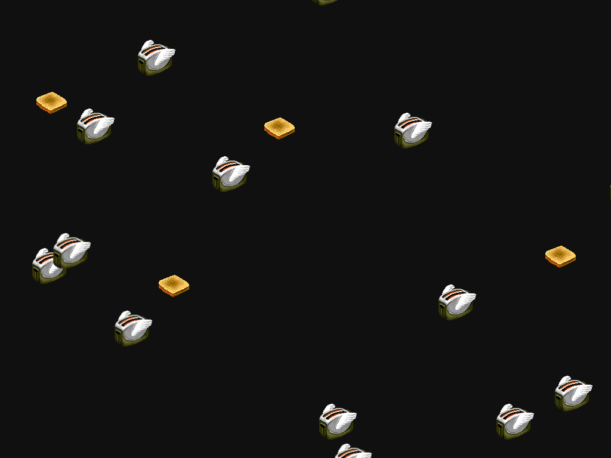

### Fish


### Globe

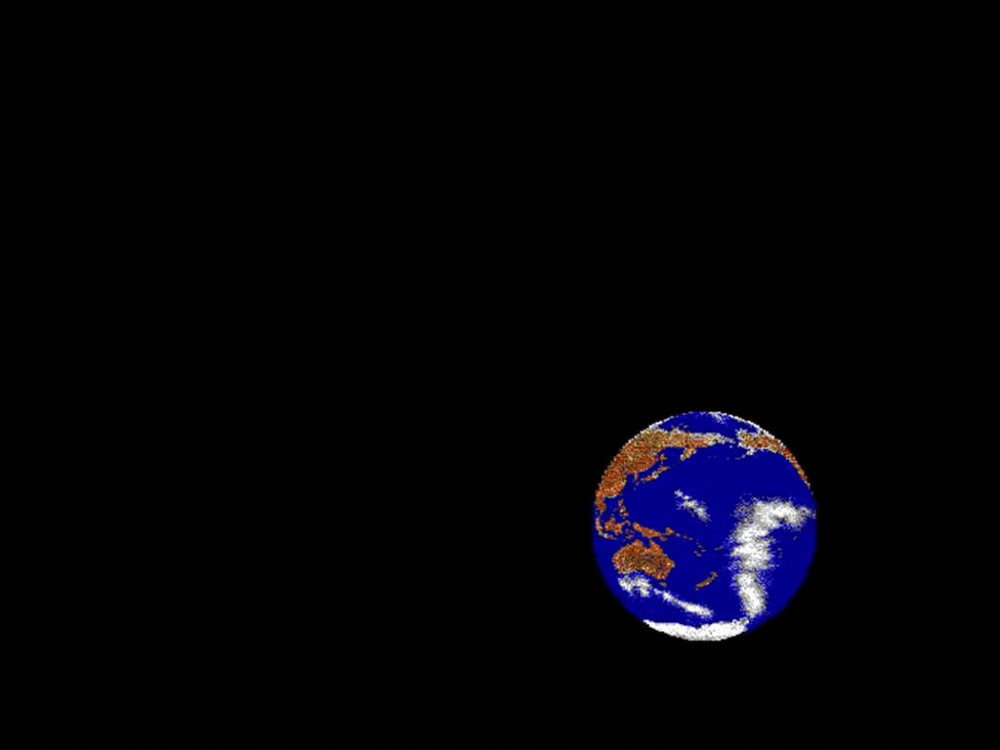

### Hard Rain

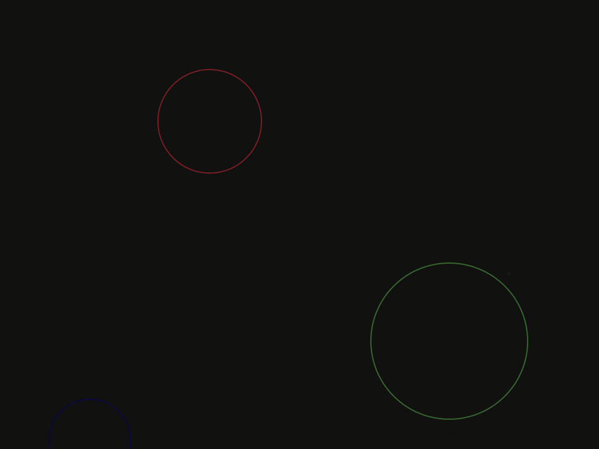

### Bouncing Ball

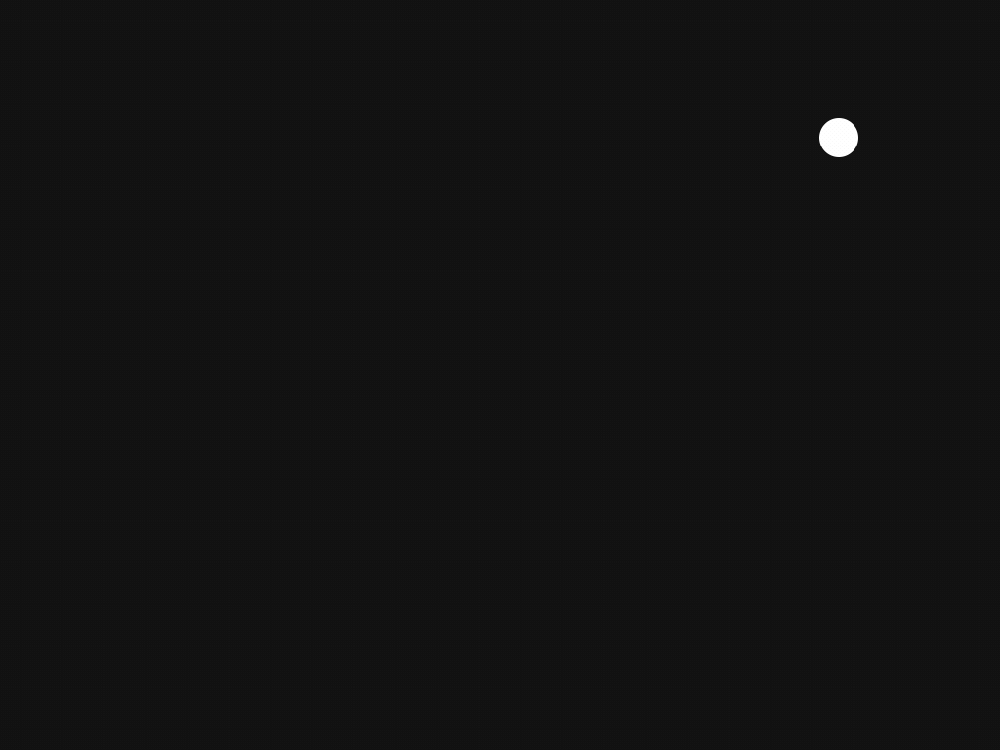

### Warp

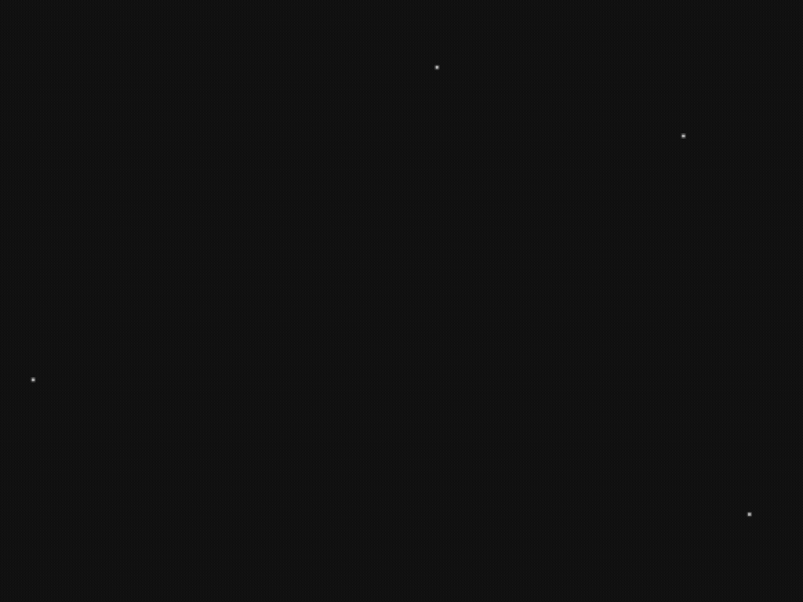

### Messages

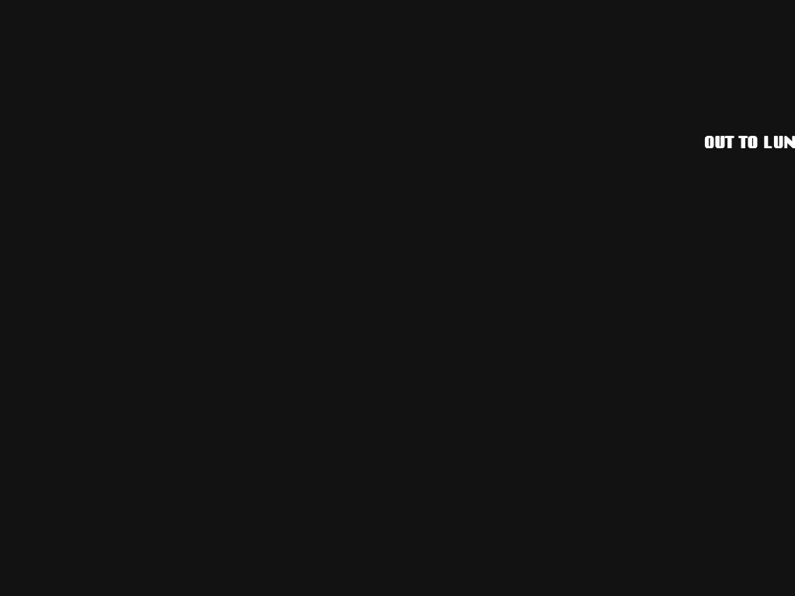

### Messages 2

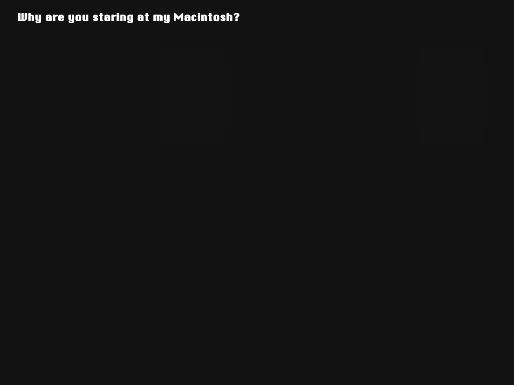

### Fade Out

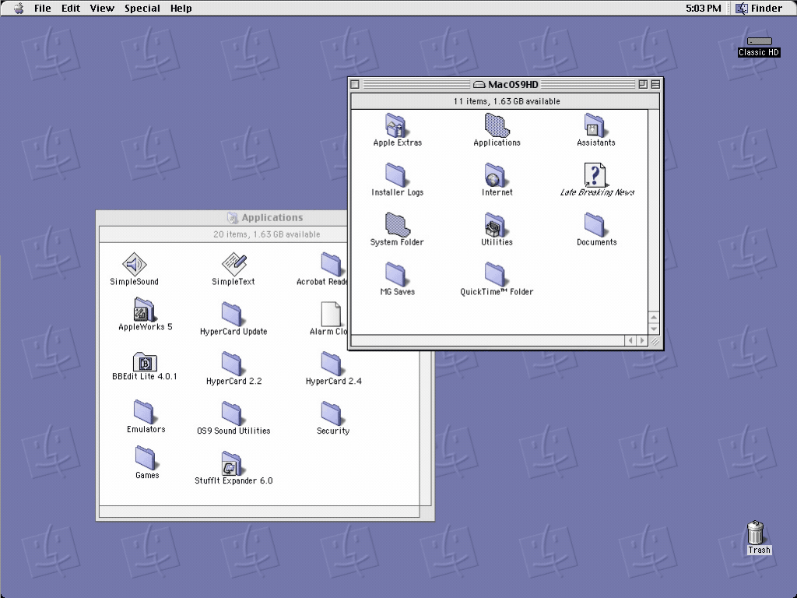

### Logo

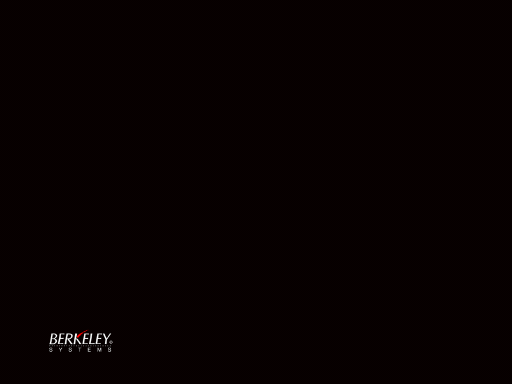

### Rainstorm

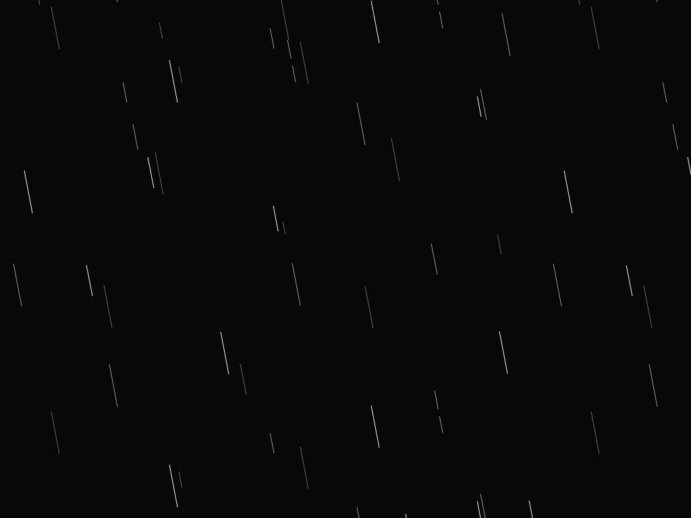

### Spotlight

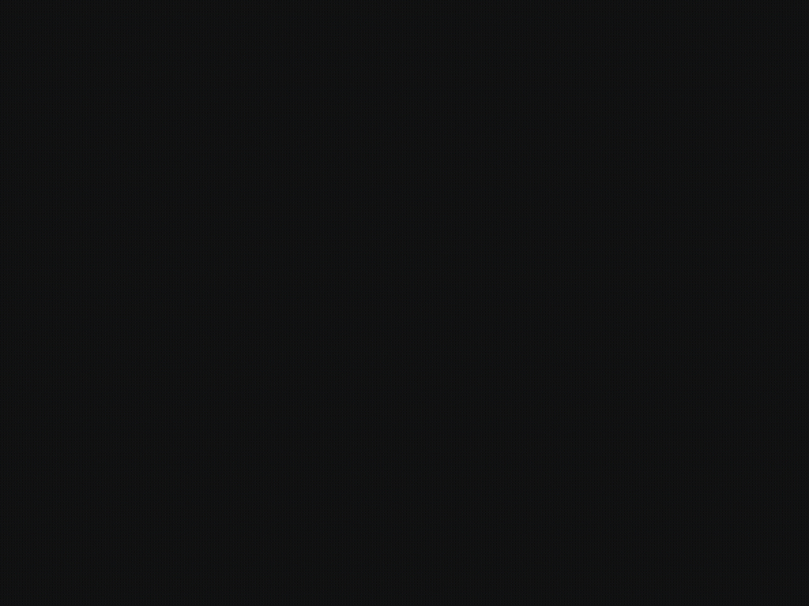

## Requirements

- macOS 10.13 or later
- Xcode with the macOS SDK (building from source only)

Release builds are universal and run natively on both Apple silicon and Intel
Macs.

## Build and install

Clone with submodules, then build and verify the screen saver:

```sh
git clone --recurse-submodules https://github.com/dustywusty/slighty-after-dark.git
cd slighty-after-dark
make verify
```

Install it for the current user:

```sh
make install
```

Then select **Slightly After Dark** in System Settings under Wallpaper →
Screen Saver. You can also run `make open` to use macOS's normal screen saver
installer UI instead of copying it directly.

The verified build artifact is written to:

```text
Build/DerivedData/Build/Products/Release/Slightly After Dark.saver
```

To remove the locally installed copy, run `make uninstall`.

Local builds are ad-hoc signed for use on the Mac that built them. A public
download should be signed with a Developer ID certificate and notarized.

## Options

Open the screen saver's Options panel in System Settings to tune the animation:

- **Smoothness** runs the macOS 26 compatibility renderer from 15 to 60 FPS
  (30 FPS by default). On the modern WebKit renderer, animations automatically
  follow the display refresh rate and this control is disabled.
- **Object size** scales foreground elements from 50% to 200% while preserving
  their crisp pixel-art rendering. Full-screen backgrounds and overlays stay at
  the display size.
- **Motion speed** changes the animation timeline from 50% to 200% independently
  of smoothness.

Changes preview immediately. **Done** saves them, while **Cancel** restores the
settings that were active when the panel opened.

## Development

The Xcode project has a shared `slightly-after-dark` scheme. Common commands:

```sh
make build             # Build a universal Release bundle
make verify            # Validate and load every saver through both renderers
make clean
```

The animations live in the pinned `after-dark-css` submodule. Builds enforce
that revision and validate every referenced runtime asset instead of silently
producing a blank screen saver. Run `make bootstrap` after updating an existing
checkout.

Gallery GIFs can be regenerated without recording the display:

```sh
make previews
```

The capture script uses the system WebKit renderer and requires `ffmpeg`.
If `gifsicle` is installed, it also performs an additional optimization pass.

The native wrapper uses `WKWebView`. macOS 26.4 introduced
[a system regression](https://developer.apple.com/forums/thread/820860) where
`WKWebView` content disappears inside legacy screen saver hierarchies, so macOS
26 releases from 26.4 onward use a compatibility renderer until Apple fixes the
host. That host also reports compatibility pages as hidden and freezes their
CSS timeline; the native screen saver timer advances the cached Web Animations
timeline at the configured frame rate so animations continue normally.
Set `SAD_WEB_RENDERER=modern` or `SAD_WEB_RENDERER=legacy` when running a local
test harness to override that automatic choice.

## Credits and asset licensing

The HTML and CSS come from
[bryanbraun/after-dark-css](https://github.com/bryanbraun/after-dark-css).
Upstream documents the HTML/CSS as MIT-licensed and the ChicagoFLF font under
the SIL Open Font License. The original imagery is copyright Berkeley Systems;
review [upstream's licensing notes](https://github.com/bryanbraun/after-dark-css#license)
before redistributing a build.
